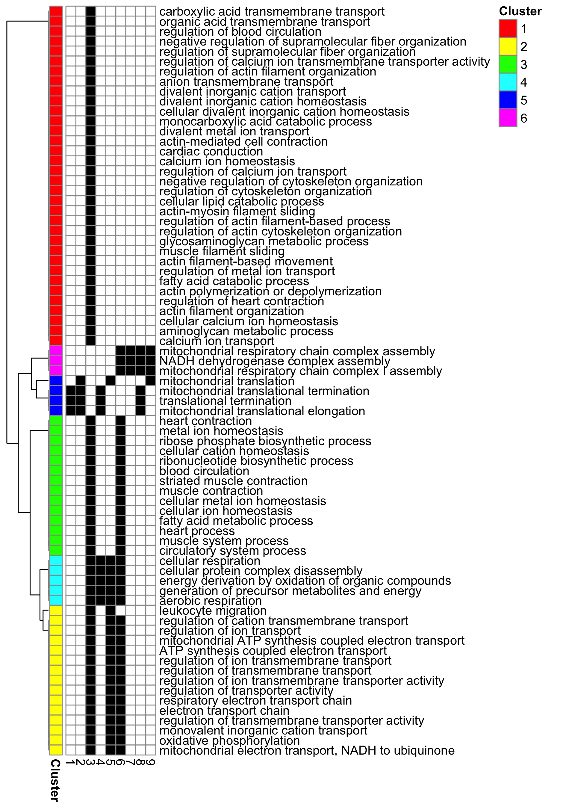

```{r, include = FALSE}
knitr::opts_chunk$set(
  collapse = TRUE,
  comment = "#>"
)
```

# Introduction
This vignette provides a quick guide to ``ontoClust`` package.

# Installation


```
devtools::install_github("altintasali/ontoClust")
```

```{r setup}
library(ontoClust)
```

# Gene enrichment results
In a typical differential expression analysis, you may want to check the ontology terms (e.g. GO, KEGG) enriched using the differentially expressed genes. A typical enrichment result looks like this:

```{r sample_data}
head(sample_data$GOBP)
```

Let's check how many enriched terms there are for a given comparison (so called "contrast").
```{r check_data}
enr <- sample_data$GOBP
enrSub <- enr[enr$Condition == "AvsB",]
enrSub <- enrSub[enrSub$qvalue < 0.05,]
nrow(enrSub)
```

As you can imagine, it is really hard to go through `r nrow(enrSub)` GO terms manually. This is where ``ontoClust`` becomes handy.

# Creating Ontology Networks 
In order to create ontology (GO) networks, we need to provide a similarity metric across GO terms in a pairwise fashion. ``ontoClust`` uses Jaccard Similarity Index using the gene content of each ontology term. ``createOntologyNetwork`` function makes this process easy for you. 

For the sake of computation time, let's work with a random subset of those `r nrow(enrSub)` GO terms. 75 terms is ideal for a quick run. 

```{r subset_data}
# set.seed(6)
# subsetTerms <- sample(x = enrSub$ID, size = 100)
subsetTerms <- enrSub$ID[1:75]
head(subsetTerms)
```

Now that we have the terms to work with, we can create the network.
```{r build_network, message=FALSE, warning=FALSE}
network <- createOntologyNetwork(subsetTerms)
head(network)
```

# Creating "Link Communities" 
In order to create link communities, we need to provide the network of GO terms. The ``getLC`` will help us to do that.

```{r getLC}
lc <- getLC(network, verbose = FALSE)
lc
```

# Creating Clusters of Ontology Terms
Finally, we can calculate the clusters of GO Terms:

```{r getOntoClust, message=FALSE, warning=FALSE}
oc <- getOntoClust(lc, verbose = FALSE)
str(oc)
table(oc$ontoClust)
```

# Plot Ontology Clusters
## Heatmap 
```{r heatmap, results='hide'}
heatmapOntoClust(oc, filename = "heatmapOntoClust.png")
```
```{r, echo=FALSE, out.width="90%", fig.cap="Heatmap of Ontology Clusters"}

```
## Network Plot


